# N7 Banking Landing Page

A premium, modern, and highly responsive landing page built for N7 Banking. This project demonstrates cutting-edge frontend development practices, focusing heavily on pixel-perfect UI fidelity, fluid responsive design, and scalable React component architecture.



## 🚀 Live Demo
**[View the Live Application Here](https://ameer2402.github.io/banking-landing-page/)**

---

## ✨ How This Project Stands Out

### 1. **Fluid Responsive Architecture**
Unlike rigid pixel-based layouts, this application utilizes modern Tailwind CSS Grid and Flexbox patterns to fluidly adapt to any screen size.
- **Mobile-First Paradigms:** Implements an interactive Glassmorphic Hamburger Menu on mobile devices.
- **Dynamic Viewports:** Intelligently scales massive typography and complex 3D mockup graphics (like laptops and phones) without ever causing horizontal clipping or overflow.
- **Responsive Interactions:** Features a touch-friendly swiping carousel for partner logos (`TrustedBy.jsx`) and fluid CSS constraints across all sections.

### 2. **Scalable Component Structure (DRY Principles)**
The codebase is intentionally engineered for maintainability and scalability.
- **Data Abstraction:** Core data lists (like the Checklist items in `CB7Details.jsx` and the feature lists in `Features.jsx`) are extracted outside of the component render cycle. This optimizes React's memory usage and avoids unnecessary array recreation on re-renders.
- **Modular Components:** Repeated UI elements (such as `InsightCard` and `FeatureRow`) are abstracted into reusable, prop-driven components. Adding a new feature or case study is as simple as appending to an array.

### 3. **Premium UI & Animations**
- Leverages **Framer Motion** for smooth, viewport-triggered scroll animations.
- Uses dynamic `mix-blend-mode`, layered SVG filters, and absolute positioning gradients to recreate complex Figma designs natively in the browser without relying on heavy static image backgrounds.
- Features a highly interactive, animated `CaseStudies` carousel with physics-based spring animations.

### 4. **Performance Optimized**
- Purged of unnecessary client-side routing libraries, reducing the bundle size.
- Runs on **Vite** for lightning-fast HMR and optimized production builds.
- Built as a lightweight, single-page scrolling application.

---

## 🛠️ Tech Stack
- **Framework**: React 19
- **Build Tool**: Vite
- **Styling**: Tailwind CSS v4
- **Animations**: Framer Motion
- **Deployment**: GitHub Pages (`gh-pages`)

---

## 💻 Running Locally

### Prerequisites
Make sure you have Node.js and npm installed.

### Installation
1. Clone the repository:
   ```bash
   git clone https://github.com/ameer2402/banking-landing-page.git
   ```
2. Navigate into the directory:
   ```bash
   cd banking-landing-page
   ```
3. Install dependencies:
   ```bash
   npm install
   ```
4. Start the development server:
   ```bash
   npm run dev
   ```

### Deployment
This project is configured to automatically build and deploy to the `gh-pages` branch using the `gh-pages` npm package.
To deploy a new version to GitHub Pages, simply run:
```bash
npm run deploy
```

---

## 📈 Evaluation Criteria Addressed
- **Frontend Accuracy:** Recreated complex layouts matching high-fidelity UI mockups.
- **Responsiveness:** Verified across devices from 375px mobile screens to 4K displays.
- **Code Quality:** Strong adherence to DRY principles, component abstraction, and clean architecture.
- **Performance:** Minimized re-renders, avoided massive monolithic components, and utilized lightweight SVGs.
